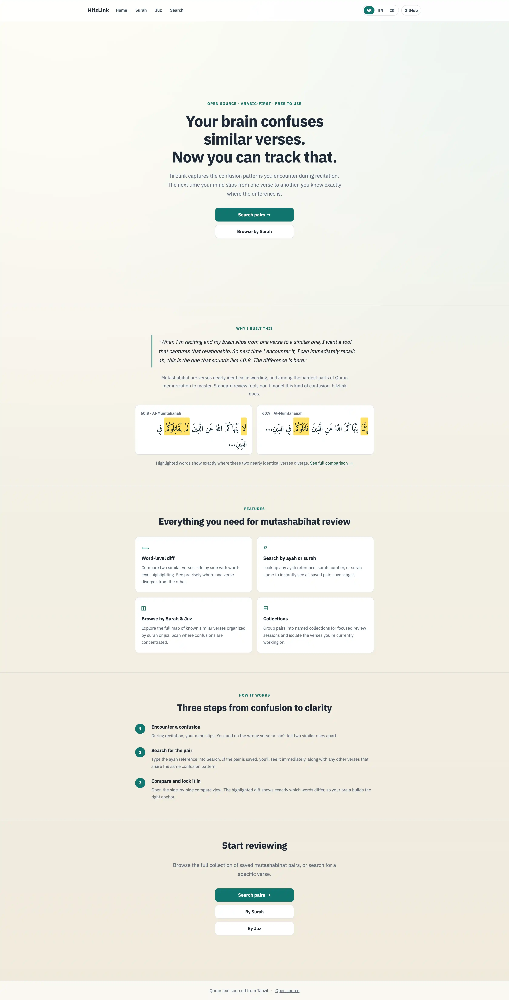

# HifzLink (Quran Murojaah)

Simple Go web app to help memorizers review similar Quran verses (mutashabihat).



## Stack

- Go (`net/http`)
- SQLite (relations + user sessions)
- server-rendered HTML templates
- local JSON Quran dataset (`data/quran.json`)
- Quran Foundation OAuth2 + Content/Bookmarks API

## Run

```bash
go run ./cmd/server
```

Server listens on `http://localhost:8080`.

## Environment Variables

```bash
PORT=8080
HIFZLINK_ADMIN_USER=
HIFZLINK_ADMIN_PASS=
HIFZLINK_UMAMI_ID=           # optional Umami analytics site ID

# Quran Foundation OAuth2
QF_CLIENT_ID=
QF_CLIENT_SECRET=
QF_AUTH_ENDPOINT=https://oauth2.quran.foundation
QF_API_BASE=https://apis.quran.foundation
QF_REDIRECT_URI=https://your-domain.com/auth/callback
```

Copy `.env.example` and fill in the values.

## Authentication

Users log in with their Quran Foundation account via OAuth2. On first login, a local user record is created automatically. Sessions are stored in SQLite with a 7-day expiry.

Admin access uses separate HTTP Basic Auth (env vars above). Admin routes are protected independently of user sessions.

## Features

- **Mutashabihat pairs**: browse, search, and compare similar verses side-by-side with word-level diff highlighting
- **Practice Mode**: on the compare page, blur one side and test your recall before revealing
- **Collections**: save ayahs and pairs into personal collections; mark items as mastered to track progress
- **Dashboard**: recent saved items, mastered badges, QF bookmark integration with last-sync timestamp
- **QF Bookmarks**: bookmarks synced from your Quran Foundation account are shown on the dashboard and matched to saved pairs
- **Audio**: play verse audio via the QF Content API on ayah pages
- **Tafsir**: collapsible Ibn Kathir (EN) and Kemenag RI (ID) tafsir on ayah pages
- **Surah/Juz metadata**: place of revelation, ayah count, and juz start verse shown on listing pages
- **Search**: by ayah ref, surah number, surah name, or category; filter pills; empty-state suggestions
- **Stats**: homepage shows live pair count, 114 surahs, 6,236 ayahs

## Quran Dataset Workflow

Import full dataset from Tanzil into `data/quran.json`:

```bash
go run ./scripts/import
```

Validate dataset integrity:

```bash
go run ./scripts/validate
```

Validate translation key format and coverage:

```bash
go run ./scripts/validate_translations
go run ./scripts/validate_translations -report
```

Import English and Indonesian translations:

```bash
go run ./scripts/import_translations
```

This also generates Indonesian tafsir data at `data/tafsir/id.kemenag.json`.
It also generates English tafsir data at `data/tafsir/en.ibn-kathir.json`.

Seed starter relation pairs:

```bash
go run ./scripts/seed_relations
```

## API

- `GET /api/ayah/{surah}/{ayah}`
- `GET /api/ayah/{surah}/{ayah}/relations`
- `POST /api/relations`
- `GET /api/surah/{surah}/relations`
- `GET /api/juz/{juz}/relations`

## Admin UI

- `GET /admin/relations` relation management page (add/list/edit/delete)
- optional relation categories for grouping: `lafzi`, `maana`, `siyam`, `aqidah`, `adab`, `other`
- category labels and usage hints are shown directly on the admin page
- invalid category values are normalized to `Uncategorized`
- admin routes and `POST /api/relations` require HTTP Basic Auth
- set credentials via env:
  - `HIFZLINK_ADMIN_USER`
  - `HIFZLINK_ADMIN_PASS`

## Collections

- `GET /collections` list and create personal collections
- `GET /collections/{id}` view saved items in a collection
- save ayah from Ayah page and save pair from Compare page into a selected collection
- duplicate saves show a clear status message (`Already saved in this collection`)
- collection list/detail shows saved metadata (item type and timestamp)
- mark saved pairs as mastered from the Compare page; mastered items show a badge on the dashboard

Add relation example:

```bash
curl -X POST http://localhost:8080/api/relations \
  -H 'Content-Type: application/json' \
  -d '{"ayah1":"60:8","ayah2":"60:9","note":"mutashabihat"}'
```

## Open Source Docs

- [CONTRIBUTING.md](./CONTRIBUTING.md)
- [CHANGELOG.md](./CHANGELOG.md)
- [LICENSE](./LICENSE)
- [NOTICE.md](./NOTICE.md)
- [docs/VERSIONING.md](./docs/VERSIONING.md)
- [docs/DESIGN.md](./docs/DESIGN.md)
- [docs/TRANSLATIONS.md](./docs/TRANSLATIONS.md)
- [docs/MUTASHABIHAT_STRATEGY.md](./docs/MUTASHABIHAT_STRATEGY.md)
- [docs/STATUS.md](./docs/STATUS.md)
- [docs/ROADMAP.md](./docs/ROADMAP.md)
- [docs/TRANSLATION_MIGRATION_2026-03-22.md](./docs/TRANSLATION_MIGRATION_2026-03-22.md)
- [docs/PROJECT.md](./docs/PROJECT.md)
- [docs/ARCHITECTURE.md](./docs/ARCHITECTURE.md)

## Project Structure

- `cmd/server/main.go` HTTP server, routes, and request handlers
- `internal/search` Quran dataset loader and ayah lookup
- `internal/db` SQLite storage for relations, users, sessions, and collections
- `internal/relations` relation service and ayah parser
- `web/templates` server-rendered pages
- `web/static` CSS
- `data/quran.json` local Quran dataset
- `data/relations.seed.json` starter relation pairs
- `scripts/import` imports full Quran text + metadata from Tanzil
- `scripts/import_translations` imports `en` from Quran.com verse-route data (Clear Quran text shown on site), `id` from `rioastamal/quran-json`, and prepares Indonesian + English tafsir data
- `scripts/validate` validates dataset contract
- `scripts/validate_translations` validates translation key format and coverage against `data/quran.json`
- `scripts/seed_relations` seeds initial mutashabihat relation examples
