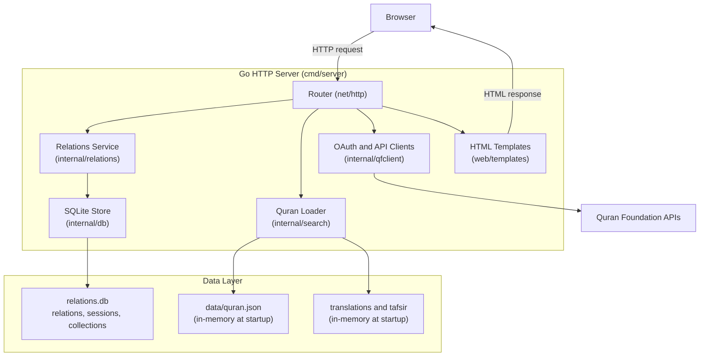
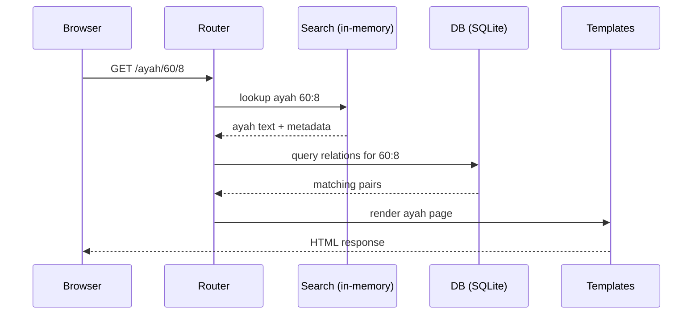

# Architecture

This document describes the system architecture.

## System overview

The application consists of five main parts:

1. Local Quran, translation, and tafsir datasets
2. Go backend server
3. SQLite persistence
4. Server-rendered frontend
5. Optional Quran Foundation account services



## Quran dataset

Primary file:

- `data/quran.json`

Loaded into memory at server startup.

Each record:

- `surah`
- `surah_name`
- `ayah`
- `juz`
- `text_ar`

### Data ingestion flow

1. source dataset is placed in `data/raw/` (optional workspace)
2. transform/normalize into project schema
3. write output to `data/quran.json`
4. run validation checks
5. commit generated dataset and attribution updates

### Validation rules

- total records: `6236`
- unique key: `(surah, ayah)`
- non-empty Arabic text for `text_ar`
- valid surah range: `1..114`

## Backend

The backend is a Go HTTP server.

Responsibilities:

- Load Quran, translation, and tafsir datasets.
- Handle public, account, collection, and administration routes.
- Store relations and account-specific state in SQLite.
- Integrate with Quran Foundation OAuth, bookmarks, audio, and content APIs.
- Render and serve HTML pages and static assets.

## Database

SQLite database.

The database stores mutable application state. Quran text, translations, and
tafsir remain in versioned JSON files and load into memory at startup.

Primary tables:

- `relations`: curated ayah pairs, categories, highlights, source, and review
  state.
- `sessions`: Quran Foundation account identity, expiring OAuth sessions, and
  token state.
- `collections`: user-created murojaah collections.
- `collection_items`: saved ayahs and pairs, including mastery state.

Schema changes use additive migrations in `internal/db`.

## Folder structure

- `cmd/server/main.go`
- `internal/db`
- `internal/relations`
- `internal/search`
- `web/templates`
- `web/static`
- `data/quran.json`
- `data/translations`
- `data/tafsir`
- `data/relations.seed.json`

## Request flow

Example: `GET /ayah/60/8`



## Compare mode

Compare view renders two verses side-by-side.

Used to reduce confusion for similar wording.

## Performance

The Quran dataset is small enough for full in-memory loading.

This keeps verse lookup fast and simple.

## Deployment

Run the local server with one command:

```bash
go run ./cmd/server
```

The same Go binary serves staging and production. Each environment uses its own
configuration and SQLite database. Develop on a feature branch, merge through
`staging`, verify the result, and promote the verified commit to `main` through
a pull request. Operational deployment configuration is maintained outside this
public source repository. The former legacy production branch is retained only
under its archive tag.

## Design philosophy

Keep everything simple.

Avoid unnecessary dependencies.

Prioritize clarity, maintainability, and accurate Quran text handling.
